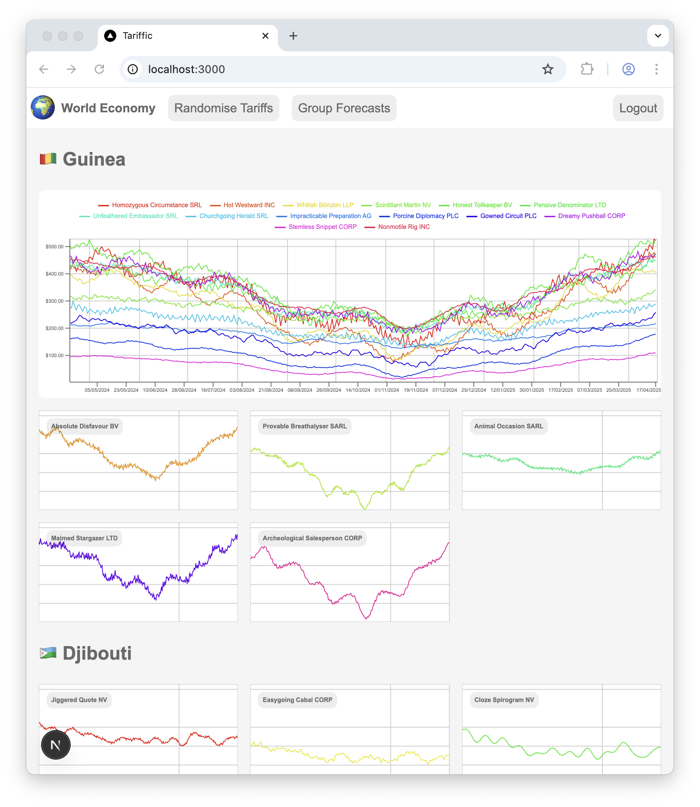

# World Economy Dashboard

This demonstrator uses Numpy and FastAPI on the backend, with React, NextJS, and Recharts on the frontend. Although the content is whimsical, it does provide an opportunity to push a realistic quantity of data through Recharts. 



## Docker Compose

Clone this repository, install Docker, run `docker-compose up`, then visit http://localhost:3000 for the UI and http://localhost:8000/docs for the API.

Python package installation of `nltk` is slow. First call to the index route will pull down wordnet data, also slow; subsequent calls use a cached version.

## UI

At the frontend the `Randomise Tariffs` button fetches a new index (which creates a new set of countries, companies and forecasts), and a `Group Forecasts` toggle which routes between two pages, one where every company in a country has its forecasts grouped into one plot, and another where companies' forecasts are displayed as thumbnail plots. In the latter, a hover exposes a pin button. This creates one large plot, to which selected companies can be added. Hovering the large plot exposes a close button, which restores the selected companies to thumbnail form. These operations provide a reasonable simulation of data exploration using React and Recharts. 

State is held in a React Context hook.

Thumbnails have a cartesian grid whose verticals align to year boundaries. Large plots have a grid whose verticals align to month boundaries.

CSS is hand-rolled (including animations), icons are emoji, and the layout is responsive.

## API

The backend has two routes.

### Forecast Index

This defines a temporal range for the data of all forecasts and a list of randomly selected countries. 
Each country has a list of companies with randomly generated names, such as `Tranquillising Keystroke SARL` and a link to the forecast data for that company.

Each forecast token, for example `ITm9WccxGzxAUvopHTlAUo85bzlAUjJFDj8ASctEaT4ASepFJTwASV1QHTQJPI1YrykJPGlWOSkJPKhXtDcJPE1YkzYJPDBJKDUARbtI4jcARTRH3zMART5I3C4ARV9IwTcARQ==`, 
contains a base64 encoded numpy buffer of float16's which define the forecast data. 

```
curl -X 'GET' \
  'http://localhost:8000/forecast' \
  -H 'accept: application/json'
```
```json
{
  "end_date": "2025-04-21T14:54:48",
  "start_date": "2024-04-21T14:54:48",
  "countries": [
    {
      "flag": "🇬🇼",
      "name": " Guinea-Bissau",
      "companies": [
        {
          "name": "Valorous Attrition SRL",
          "forecast_url": "/forecast/ITm9WccxGzxAUvopHTlAUo85bzlAUjJFDj8ASctEaT4ASepFJTwASV1QHTQJPI1YrykJPGlWOSkJPKhXtDcJPE1YkzYJPDBJKDUARbtI4jcARTRH3zMART5I3C4ARV9IwTcARQ=="
        },
        {
          "name": "Malformed Grinding LLP",
          "forecast_url": "/forecast/mzotWMcxGzxAUvopHTlAUo85bzlAUjJFDj8ASctEaT4ASepFJTwASXBUxzW6RPtRxzW6RAVWlTe6RDZV5Ta6RCxVTze6RKZJ1DIARdhH-DEARatIkS4ARc9GJjEARQdJwTMARQ=="
        },
        {
          "name": "Invincible Refill LTD",
          "forecast_url": "/forecast/6z8wV8cxGzxAUvopHTlAUo85bzlAUjJFDj8ASctEaT4ASepFJTwASbdVXDd-QzlWKzZ-Q8RVxDV-QxBWwjR-Q6dQ-jN-Q_BH9zQARRlG9jYARYNGgykARfZJlC4ARTNIgTUARQ=="
        },
        {
          "name": "Tranquillising Keystroke SARL",
          "forecast_url": "/forecast/Sz9LUMcxGzxAUvopHTlAUo85bzlAUjJFDj8ASctEaT4ASepFJTwASa1YGTUgQilW6jQgQj9YWysgQllScTYgQrdVcy8gQhpIpjcARTJGzjIARRNIKDcAReNHIS8ARdNJMDcARQ=="
        },...
    },...
  ]
}
```

### Forecast data

The forecast data route can then be called by the UI for each company. It unpacks the token's parameters and uses them to compose a set of sine waves, which are then reduced to a list of numeric samples. 

Companies from the same Country have common (low-frequency) parameters, simulating a sense of common economic circumstances (such as tariffs).

```
curl -X 'GET' \
  'http://localhost:8000/forecast/Sz9LUMcxGzxAUvopHTlAUo85bzlAUjJFDj8ASctEaT4ASepFJTwASa1YGTUgQilW6jQgQj9YWysgQllScTYgQrdVcy8gQhpIpjcARTJGzjIARRNIKDcAReNHIS8ARdNJMDcARQ%3D%3D' \
  -H 'accept: application/json'
```

```json
[
  179.08533812472228,
  187.75500051936373,
  180.97504731723015,
  186.0720822806967,
  200.722197706659,
  177.04835186368447,
  202.8192464330784,
  201.59957822273296,
  177.81589595281014,
  183.06163102463432,
  179.0079263967165,
  195.55531875810777,
  184.02643118532524,
  174.7343517381075,
  193.78321390102852,
  ...
]
```

